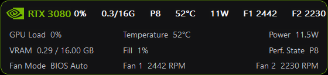
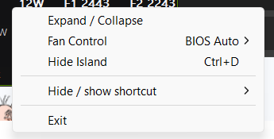
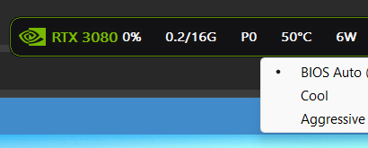

# X1 AI Island v1.1.3

A tiny native Windows overlay for Lenovo ThinkPad AI workstations with an
NVIDIA dGPU. The Island detects and displays the NVIDIA model reported by NVML
instead of hard-coding a specific GeForce or RTX model.

## Screenshots

### Expanded telemetry

Double-click the Island to open a fixed six-column, three-row dashboard.
Each row contains three label/value pairs; labels are left-aligned and stay in place
when values change. Both expanded and compact views are 520 pixels wide.
Expanded VRAM shows only used memory (for example `9.3GB`); `VRAM-Use` shows
its percentage. `Temp` and `VRAM-Use` keep labels readable at this width.
Unavailable readings keep their cells and show `N/A` (or `Unavailable` for fan mode).
The screenshot below shows the previous layout.

Rendering uses a reusable double buffer with direct-paint fallback if GDI allocation
fails. Telemetry refreshes only request repaint when visible text or the load color
changes; animation ticks retain their existing behavior.

### Context menu

Right-click the Island to access display controls, Reset to top center,
Auto-hide on hover, the global hide/show shortcut, Fan Control, About
information and Exit.

### Fan Control

Press `Ctrl+Shift+F`, or open the Fan Control submenu, to select BIOS Auto,
Cool or Aggressive with the keyboard.

## What v1.1.3 shows

- NVIDIA GPU utilization
- Dedicated VRAM used / total
- GPU temperature
- GPU power draw when the driver exposes it
- NVIDIA performance state (`P0` through `P8` when exposed by the driver)
- Compact fan reading `F`: the maximum of Fan 1 and Fan 2 RPM, or `F --` when unavailable
- Expanded view retains separate Fan 1 and Fan 2 RPM through `X1FanService`
- `F` is not a GPU-fan identification; the EC channels have no verified CPU/GPU mapping
- A thin rounded status border driven by the higher of VRAM usage or dGPU load:
  - NVIDIA-green breathing pulse below 50%
  - yellow-dominant RGB pulse from 50% through 79%
  - red-biased RGB breathing pulse from 80% upward
- GPU wins ties when GPU load and VRAM fill are equal
- The `RTX 3080` text is fixed NVIDIA green below 50% GPU load, then uses the yellow/red warning animations based only on GPU load
- Embedded NVIDIA logo image

It deliberately queries NVIDIA telemetry through `nvml.dll` instead of treating Windows "GPU 0/GPU 1" as a stable identity. It prefers a device whose NVIDIA name contains `RTX 3080`, otherwise it uses the first NVIDIA device.

## Why this architecture

The UI is plain Win32/GDI. It does not create a Direct3D rendering context on the RTX just to draw the overlay. NVIDIA is queried only for telemetry.

No CUDA Toolkit, Python, .NET, Electron, or LibreHardwareMonitor is required. `nvml.dll` normally comes with the NVIDIA display driver.

## Fan telemetry service

`X1FanService.exe` is a LocalSystem service and a small fan-mode controller for
the ThinkPad X1 Extreme Gen 4 machine type `20Y6`. It reads both tachometers
through the open-source PawnIO driver and publishes telemetry to the Island.

- It always starts in **BIOS Auto**, the default and safest mode.
- **Cool** starts both fans earlier.
- **Aggressive** starts both fans earlier and at higher EC levels.
- At high temperature, custom modes return control to BIOS.
- Stop, shutdown, and normal service exit also return control to BIOS.
- Closing the Island requests **BIOS Auto** immediately. The independent
  Windows service remains available for the next launch, but polls less often
  in BIOS Auto (especially on battery).
- It restores the fan selector to Fan 1 after each sample.
- Missing service/driver data appears as `N/A`; the Island continues normally.

Install PawnIO 2.2.0 first, build the project, then run
`install_fan_service.bat` as Administrator. Use
`uninstall_fan_service.bat` to remove only X1FanService.

Run `X1FanService.exe` normally, or use the **Fan Control** submenu in the
Island's right-click menu, to choose BIOS Auto, Cool, or Aggressive directly.

Press **Ctrl+Shift+F** to open the Fan Control submenu directly, then use the
arrow keys and Enter. Compact mode stays unchanged in BIOS Auto, shows a fixed
NVIDIA-green `COOL` badge in Cool mode, and shows an animated yellow/red
`AGGR` badge in Aggressive mode.

## Fan Control safety

GPU monitoring uses NVIDIA NVML and can work with other NVIDIA dGPU models.
The low-level fan service is intentionally more restricted:

- `X1FanService` currently enables EC access only for the tested Lenovo
  ThinkPad machine type `20Y6`.
- Do not remove or broaden the model guard unless the EC registers and fan
  behavior have been verified on that exact laptop model.
- **BIOS Auto** is the default and safest mode.
- Cool and Aggressive are optional custom curves. At high temperature, service
  shutdown, or normal Island exit, control is returned to the BIOS.
- PawnIO is a third-party kernel driver. Review
  [`THIRD_PARTY_NOTICES.md`](THIRD_PARTY_NOTICES.md) before installing it.
- GPU monitoring remains usable when the fan service or PawnIO is not
  installed; fan values will simply appear as unavailable.

## Build

Recommended:
1. Install Visual Studio 2022 Build Tools with **Desktop development with C++**.
2. Open **x64 Native Tools Command Prompt for VS 2022**.
3. `cd` into this folder.
4. Run `build.bat`.
5. Optionally install the fan service.
6. Run `X1-AI-Island.exe`.

## Controls

- Default position: top-center of the primary screen.
- Drag: move Island.
- Double-click: expand/collapse.
- **Ctrl+D**: hide/show globally (default).
- Right-click or press **Ctrl+Alt+I**: open the Island context menu to access
  Fan Control, expand/collapse, hide, change the global shortcut, About, or Exit.
- The Island uses 85% window opacity to soften the dark background while
  keeping compact telemetry and the animated border easy to read.
- Animation refresh is adaptive: warnings stay responsive while the normal
  green state uses fewer wakeups, with a further reduction on battery.
- Telemetry text is cached and rebuilt only when the one-second readings update.
- Telemetry refresh changes from one second on AC to two seconds on battery.
- Telemetry and animation timers stop completely while the Island is hidden.
- Only one Island instance can run in the current Windows session. Launching it
  again restores the existing Island if hidden and brings it back to topmost.
- Expanded view is intentionally concise: GPU status, VRAM use, fan mode, and
  both fan RPM values. Its aligned columns use explicit labels such as
  `GPU Load` and `Performance State`. It omits duplicate border and
  memory-engine details.
- The Island restores its topmost z-order whenever it is shown, moved, resized,
  or reset, without a continuous z-order polling timer.
- `Auto-hide on hover` is enabled by default: hover for one second to hide the
  Island for five seconds so content beneath it can be seen, then return
  automatically. Toggle it from the context menu; the setting persists.
- All NVML, shared-memory, event, GDI, hotkey and mutex resources owned by the
  Island are explicitly released on exit.

## Verify

Run `nvidia-smi` beside the Island and compare GPU utilization, VRAM, temperature, and power.

## Version

Version **1.1.3** adds safe NVML self-healing recovery after driver crashes,
restarts, or GPU power-state disconnects without requiring an application restart.
Internal bitmap assets are compressed with RLE8 encoding to reduce application size
and initial loading time.

Version **1.1.2** narrows both views to 520 pixels and introduces a fixed
six-column, three-row expanded layout with separate labels and values.
Compact mode shows `F` as the maximum of both fan RPM readings; expanded mode
retains both fans and shows used VRAM without the total. It also skips redundant
telemetry repaints, safely falls back when backbuffer creation fails, and adds
color-output, resize, allocation-failure, label-fit and GDI resource tests.

Version **1.1.1** caches compact text measurements between animation frames,
restores the original GDI font even when the primary font is unavailable,
and rejects fan telemetry snapshots when sequence validation fails.

Version **1.1.0** restores the topmost z-order whenever the Island becomes
visible or changes state. It also adds a persisted, default-enabled
**Auto-hide on hover** context-menu toggle.

Version **1.0.5** adds **Reset to top center** to the context menu, restoring
the Island to its default position at the top center of the primary display.

Version **1.0.4** reduces timer wakeups and EC polling on battery, removes
per-sample heap allocation from the fan service, explicitly releases owned
resources, and returns fan control to BIOS Auto when the Island exits.
